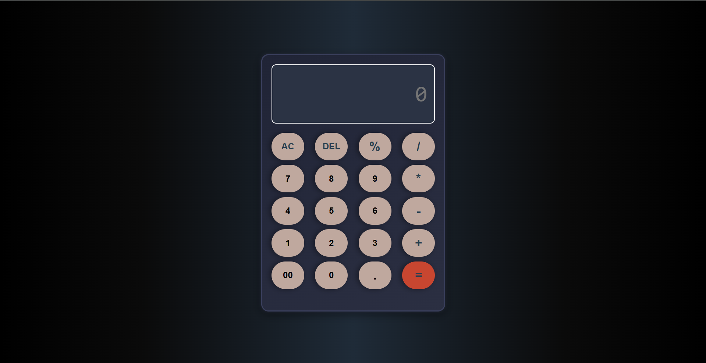

# NexCalc 🧮⚡  
A sleek, responsive, and keyboard-compatible modern calculator built using **HTML**, **CSS**, and **JavaScript**.



---

## 🚀 Features

- ✅ Basic arithmetic operations: `+`, `−`, `×`, `÷`
- 🎯 Real-time input and output display
- ⌨️ Keyboard input support for faster calculations
- 📱 Fully responsive design – works on all screen sizes
- ✨ Clean and modern UI

---

## 📸 Live Demo

👉 [Check NexCalc Live]()  
(https://huzaifa-nath.github.io/NexCalc-/)

---

## 🛠️ Built With

- **HTML5** – for structure  
- **CSS3** – for stylish layout & responsive design  
- **JavaScript** – for all the functional logic & keyboard interaction

---

## 📂 How to Use

1. Clone the repo:
   ```bash
   git clone https://github.com/huzaifa-nath/NexCalc.git
   
